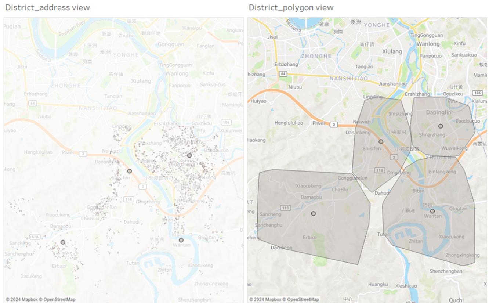
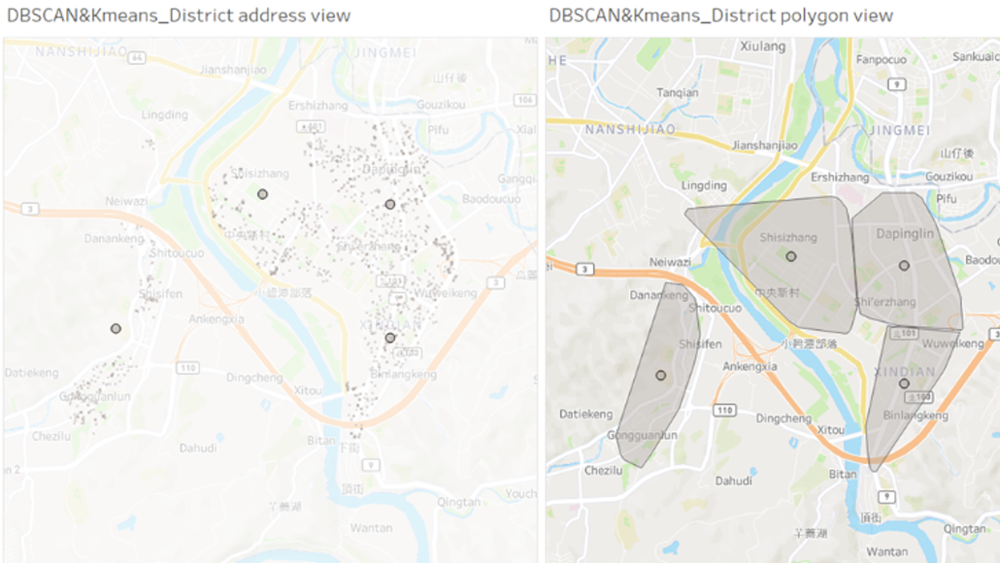

## Store Expansion Project

In this project, we utilized DBSCAN and K-means algorithms to analyze order addresses and determine optimal locations for opening new stores. By clustering order data, we identified strategic areas that efficiently manage order volumes within each store's coverage. This data-driven approach not only enhances operational efficiency but also improves customer satisfaction by ensuring timely and effective service delivery.

### Key Highlights:
- Applied DBSCAN and K-means algorithms for clustering.
- Identified strategic locations for new store openings based on order data analysis.
- Optimized order volume distribution to improve operational efficiency.
- Enhanced customer satisfaction through timely service delivery.

This project demonstrates our commitment to leveraging data analytics to drive strategic business decisions and expand our market presence effectively.

### Comparison:
- KMeans clustering without using DBSCAN to filter outliers

- KMeans clustering with DBSCAN to filter outliers

Since K-means clustering groups data based on distance, if there are some outlier boundary points, they will affect the position of the cluster center. Thus, we choose to filter outliers first by using DBSCAN, setting the filtering conditions as: a radius of 500 meters and a minimum of 50 orders within that radius.

- Results:
